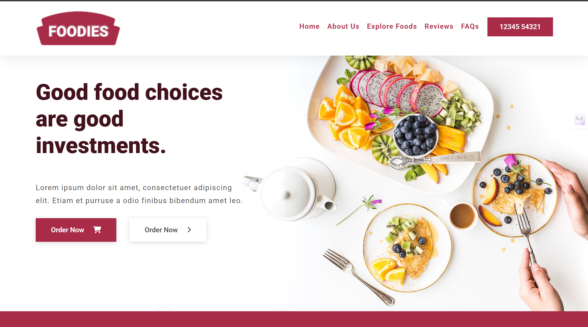

# 🛒 FreshCart

[](LICENSE)
[](https://getbootstrap.com/)
[](https://vercel.com/)

---

## 📄 Description

**Foodies** is a modern and responsive **eCommerce website template** built using **Bootstrap**.  
It features clean layouts, beautiful UI components, and a fully responsive design that adapts seamlessly to any device.

This template is perfect for building stylish online stores quickly and efficiently.

🔗 **Live Demo:**  
👉 [https://foodiescom.vercel.app/](https://foodiescom.vercel.app/)

---

## ✨ Features

✅ Modern, clean user interface  
✅ Fully responsive layout for mobile and desktop  
✅ Reusable Bootstrap components  
✅ Bootstrap Icons integration  
✅ Easy to customize

---

## 🛠 Technologies Used

- **HTML**
- **CSS**
- **JavaScript**
- **Bootstrap**
- **Bootstrap Icons**

---

## 🖼️ Screenshots

### 📱 Homepage



## ⚙️ Installation Instructions
Follow these steps to set up FreshCart locally:

1️⃣ **Clone the repository**
```bash

git clone https://github.com/codewith-hardik/foodies.com.git
```

2️⃣ **Navigate into the project directory:**

```bash
cd foodies.com
```
3️⃣ **Open index.html in your browser**

Since this is a static template, no build steps are required. You can also use a local server (like Live Server extension in VSCode) to preview.

✅ You’re ready to explore and customize FreshCart!

